# RFC AI Chat 運用・開発ガイド

## アプリケーションの概要

RFC AI Chat は、メール関連のRFC（Request for Comments）仕様に関する質問にAIが回答するWebアプリケーションです。ユーザーが日本語で質問を入力すると、学習済みのRFC文書を検索し、Google Gemini AIが適切な回答を生成します。

### 主要機能
- 日本語での質問受付（内部で英語に自動翻訳）
- RFC文書からのベクトル検索による関連情報の抽出
- Google Gemini AIによる自然な日本語回答の生成
- 回答時のRFCセクション参照リンクの提供
- 学習済みRFC一覧の表示
- ダークテーマのチャットインターフェース
- Markdown形式での回答表示

## 機能・仕組み

### システムフロー

```mermaid
graph TD
    A[ユーザー質問入力] --> B[日本語→英語翻訳]
    B --> C[Pineconeベクトル検索]
    C --> D[関連RFCセクション取得]
    D --> E[プロンプト生成]
    E --> F[Google Gemini AI回答生成]
    F --> G[日本語回答+RFC参照リンク]
    G --> H[チャット画面に表示]
```



### 詳細な仕組み
詳細な実装については、[Zenn記事](https://zenn.dev/adaisukev/articles/b24032529515d3)を参照してください。

## アプリケーション構成

### アーキテクチャ図


### 技術スタック

| カテゴリ | 技術・ライブラリ | バージョン | 用途 |
|---------|-----------------|-----------|------|
| **フレームワーク** | Next.js | 15.3.3 | Webアプリケーションフレームワーク |
| **言語** | TypeScript | ^5 | 型安全な開発 |
| **UI** | React | ^19.0.0 | UIライブラリ |
| **スタイリング** | Tailwind CSS | ^4 | CSSフレームワーク |
| **UI コンポーネント** | Radix UI | - | アクセシブルなUIコンポーネント |
| **AI・LLM** | Google Gemini AI | - | 回答生成 |
| **LLM フレームワーク** | LangChain | ^0.3.24 | AI処理パイプライン |
| **ベクトルストア** | Pinecone | ^5.1.2 | RFC文書の埋め込み保存・検索 |
| **埋め込みモデル** | OpenAI Embeddings | - | テキストベクトル化 |
| **チャット機能** | Vercel AI SDK | ^4.3.10 | チャットインターフェース |
| **マークダウン** | react-markdown | ^10.1.0 | 回答の表示 |
| **デプロイ** | Vercel | - | 本番環境ホスティング |

### ディレクトリ構成

```
rfc-ai-chat/
├── src/
│   ├── app/
│   │   ├── api/
│   │   │   └── chat/
│   │   │       └── route.ts          # チャットAPI エンドポイント
│   │   ├── utils/
│   │   │   ├── pinecone.ts           # Pineconeクライアント設定
│   │   │   ├── translate.ts          # 日英翻訳機能
│   │   │   ├── prompt.ts             # AIプロンプト生成
│   │   │   └── embedding.ts          # 埋め込み処理
│   │   ├── layout.tsx                # アプリケーションレイアウト
│   │   ├── page.tsx                  # メインページ（チャット画面）
│   │   └── globals.css               # グローバルスタイル
│   ├── components/
│   │   ├── ChatArea.tsx              # チャット表示エリア
│   │   ├── QuestionForm.tsx          # 質問入力フォーム
│   │   ├── RfcList.tsx               # 学習済みRFC一覧
│   │   ├── theme-provider.tsx        # テーマプロバイダー
│   │   └── ui/                       # UIコンポーネント（Radix UI）
│   ├── hooks/
│   │   └── use-mobile.ts             # モバイル判定フック
│   └── lib/
│       └── utils.ts                  # ユーティリティ関数
├── public/                           # 静的ファイル
├── package.json                      # 依存関係定義
├── next.config.ts                    # Next.js設定
├── tailwind.config.ts                # Tailwind CSS設定
├── tsconfig.json                     # TypeScript設定
└── vercel.json                       # Vercel設定（本番環境）
```

## アプリケーションの使用方法

1. **質問の入力**: チャット画面下部のテキストエリアに日本語で質問を入力
2. **送信**: Enterキーまたは送信ボタンで質問を送信
3. **回答の確認**: AIが生成した回答と参照RFC情報を確認
4. **RFC参照**: 回答に含まれるリンクから該当のRFCセクションにアクセス可能
5. **RFC一覧**: 右側のパネルで学習済みRFC一覧を確認

### 学習済みRFCの番号一覧

現在、以下のRFCが学習済みです（主にメール関連）：

```
1939, 2045, 2046, 2047, 2048, 2049, 2505, 3461, 3463, 3464, 3501, 3798,
4409, 5248, 5321, 5322, 5617, 5751, 5788, 6376, 6522, 6530, 6531, 6532, 
6533, 7208, 7489, 8058, 8463, 8551, 8616, 8617
```

## 環境構築手順

### 前提条件

- Node.js 18.x以上
- npm または yarn
- Git

### 手順

#### 1. リポジトリのクローン

```bash
git clone git@github.com:AdaisukeV/rfc-ai-chat.git
cd rfc-ai-chat
```

#### 2. 依存関係のインストール

```bash
npm install
```

#### 3. 開発サーバーの起動

```bash
vercel dev
```

アプリケーションは http://localhost:3000 でアクセス可能になります。

## 開発・デプロイ手順

### 開発プロセス

#### 1. 開発環境で作業ブランチを作成

```bash
git switch -c feature/your-feature-name
```

#### 2. 作業ブランチで開発

- コードの変更
- リンターでのコード品質チェック: `npm run lint`
- ビルドテスト: `npm run build`

#### 3. 開発サーバーで動作確認

```bash
vercel dev
```

#### 4. 変更内容をリモートの作業ブランチにpush

```bash
git add -A
git commit -m "feat: your feature description"
git push origin feature/your-feature-name
```

> [!TIP]
> `git add -A`を実行すると、全ての変更（追加・更新・削除）がステージングに上げられます。
> 変更内容を個別に確認して慎重に進める場合は、以下の手順で進めることをお勧めします。
> 
> 1. `git status`で変更内容を確認する  
> 2. `git diff`で変更内容の詳細を確認する（必要に応じて）  
> 3. `git add <ファイル名>`で個別にステージングに上げる  
> 4. `git diff --cached`でステージング内容を最終確認する

#### 5. プルリクエストの作成とマージ

### デプロイメント（Vercel自動デプロイ）

#### 初期設定

1. **Vercelアカウント作成**: https://vercel.com でアカウント作成
2. **GitHubリポジトリをインポート**: VercelダッシュボードでGitHubリポジトリを連携
3. **環境変数設定**: Vercelダッシュボードで以下を設定

| 変数名 | 値 | 説明 |
|-------|---|------|
| **LangSmith** | | |
| `LANGCHAIN_TRACING_V2` | `true` | LangSmithトレーシング有効化 |
| `LANGSMITH_ENDPOINT` | `https://api.smith.langchain.com` | LangSmithエンドポイント |
| `LANGSMITH_API_KEY` | `your_api_key` | LangSmith APIキー |
| `LANGSMITH_PROJECT` | `your_project_name` | LangSmithのプロジェクト名（未指定の場合、`default`が適用される） |
| **LangChain** | | |
| `GOOGLE_API_KEY` | `your_api_key` | Google Gemini APIキー |
| `OPENAI_API_KEY` | `your_api_key` | OpenAI APIキー（Vercel AI SDKでも使用される） |
| **Vercel AI SDK** | | |
| `GOOGLE_GENERATIVE_AI_API_KEY` | `your_api_key` | Google Gemini APIキー |
| **Pinecone** | | |
| `PINECONE_API_KEY` | `your_api_key` | Pinecone APIキー |
| `PINECONE_INDEX` | `rfc-index-openai` | Pineconeインデックス名 |

#### デプロイフロー

- **STGリリース**: 
  1. mainブランチへのPRを作成
  2. PRをmergeすると自動的にステージング環境にデプロイ
  
- **本番リリース**: 
  1. productionブランチへのPRを作成
  2. PRをmergeすると自動的に本番環境にデプロイ

## RFC追加・更新手順

新しいRFCを学習データに追加する場合は、以下のPythonスクリプトを実行してください。

> [!NOTE]
> 実行環境としては[Google Colaboratory](https://colab.google/)が利用可能です。

### RFC追加スクリプト（Google Colaboratoryを利用する場合）
#### 1. 必要なライブラリをインストール

```bash
!pip install -U langchain_openai langchain_pinecone langchain-core langchain-text-splitters
```

#### 2. RFCを学習データに追加

> [!TIP]
> 一度に多くのRFCを追加しようとすると、通信データ容量の制限に達した旨のエラーが発生することがあります。その場合は、RFCを1つずつアップロードすることをお勧めします。

```python
import os
import re
import requests
from typing import List
from google.colab import userdata
from langchain_openai import OpenAIEmbeddings
from langchain_pinecone import PineconeVectorStore
from langchain_core.documents import Document
from langchain_text_splitters import RecursiveCharacterTextSplitter

# 認証情報
os.environ['OPENAI_API_KEY'] = userdata.get("OPENAI_API_KEY")
os.environ['PINECONE_API_KEY'] = userdata.get("PINECONE_API_KEY")

# LangChainの設定
embeddings = OpenAIEmbeddings(model="text-embedding-3-small")
index_name = "rfc-index-openai"
vectorstore = PineconeVectorStore(index_name=index_name, embedding=embeddings)

# RFC本文取得
def download_rfc_text(rfc_number: str) -> str:
    url = f"https://www.rfc-editor.org/rfc/rfc{rfc_number}.txt"
    response = requests.get(url)
    response.raise_for_status()
    return response.text

# slugifyユーティリティ
def slugify(text: str) -> str:
    text = text.lower().replace(" ", "-")
    return re.sub(r"[^a-z0-9\-]", "", text)

# セクション分割（タイトル含む）
def split_into_sections(text: str) -> List[dict]:
    lines = text.splitlines()
    sections = []
    current_title = None
    current_text = []

    section_re = re.compile(r"^(\d+(?:\.\d+)*\.)\s{1,2}([A-Z].+)$")
    appendix_re = re.compile(r"^Appendix\s+([A-Z])\.\s{1,2}(.+)$")

    for line in lines:
        match = section_re.match(line)
        appendix = appendix_re.match(line)

        if match or appendix:
            if current_title:
                sections.append({
                    "id": slugify(current_title),
                    "title": current_title,
                    "text": "\n".join(current_text).strip()
                })
            if match:
                current_title = f"{match.group(1).rstrip('.')} {match.group(2).strip()}"
            elif appendix:
                current_title = f"Appendix {appendix.group(1)} {appendix.group(2).strip()}"
            current_text = []
        else:
            if current_title:
                current_text.append(line)

    if current_title:
        sections.append({
            "id": slugify(current_title),
            "title": current_title,
            "text": "\n".join(current_text).strip()
        })

    return sections

# セクション → チャンク分割（トークンベース）・メタデータ付与
def split_section_into_chunks(rfc_number: str, section: dict) -> List[Document]:
    splitter = RecursiveCharacterTextSplitter.from_tiktoken_encoder(
        chunk_size=500,
        chunk_overlap=100
    )

    chunks = splitter.split_text(section["text"])
    documents = []

    # section_anchor生成
    title = section["title"]
    anchor = ""
    section_match = re.match(r"^(\d+(?:\.\d+)*)\s", title)
    appendix_match = re.match(r"^Appendix\s+([A-Z](?:\.\d+)*)\s|$", title)

    if section_match:
        anchor = f"section-{section_match.group(1)}"
    elif appendix_match:
        appendix_id = appendix_match.group(1).replace(".", ".")
        anchor = f"appendix-{appendix_id}"

    for chunk in chunks:
        documents.append(Document(
            page_content=chunk,
            metadata={
                "rfc_number": rfc_number,
                "section_id": section["id"],
                "section_title": section["title"],
                "section_anchor": anchor
            }
        ))

    return documents

# メイン処理（複数RFC対応）
def process_rfc_documents(rfc_numbers: List[str]):
    all_docs = []

    for rfc_number in rfc_numbers:
        try:
            print(f"📥 Processing RFC {rfc_number}...")
            text = download_rfc_text(rfc_number)
            sections = split_into_sections(text)

            for section in sections:
                chunk_docs = split_section_into_chunks(rfc_number, section)
                print(chunk_docs)
                all_docs.extend(chunk_docs)

        except Exception as e:
            print(f"❌ Failed to process RFC {rfc_number}: {e}")

    if all_docs:
        print(f"🚀 Uploading {len(all_docs)} chunks to Pinecone...")
        vectorstore.add_documents(all_docs)
        print("✅ Upload complete.")
    else:
        print("⚠️ No documents to upload.")

# 実行（複数RFC番号対応）
process_rfc_documents(["RFC番号#1", "RFC番号#2", "RFC番号#3"])
```

### RFC追加後の更新手順
1. `src/app/page.tsx`の"学習済みRFCの番号一覧"を更新
2. 変更をコミット・プッシュしてSTG/本番環境に反映

## 参考リンク

- [RFC AI Chat Zenn記事](https://zenn.dev/adaisukev/articles/b24032529515d3) - 詳細な実装解説
- [Next.js Documentation](https://nextjs.org/docs) - Next.jsの公式ドキュメント
- [Vercel Documentation](https://vercel.com/docs) - デプロイメントガイド
- [Pinecone Documentation](https://docs.pinecone.io/) - ベクトルデータベース
- [LangChain Documentation](https://js.langchain.com/docs/) - AI処理フレームワーク
- [Google AI Documentation](https://ai.google.dev/docs) - Gemini AIの使用方法
- [RFC Editor](https://www.rfc-editor.org/) - RFC公式サイト
